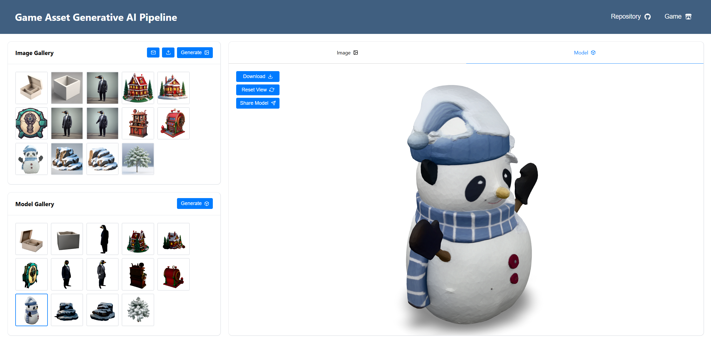
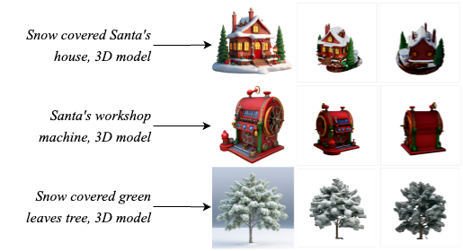
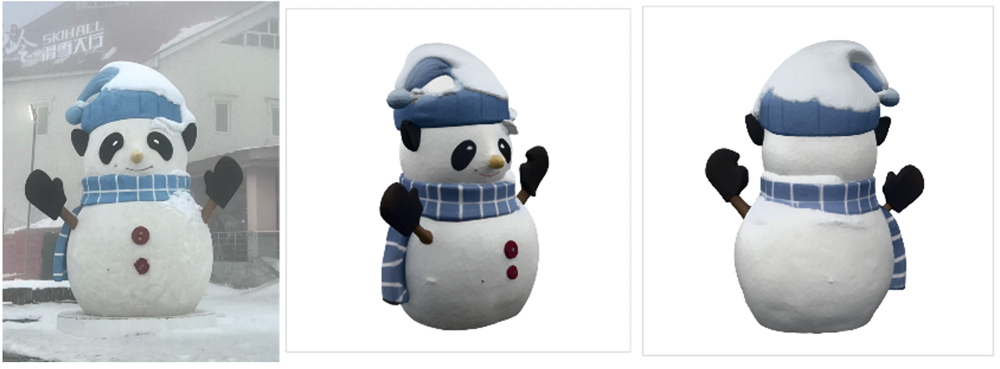
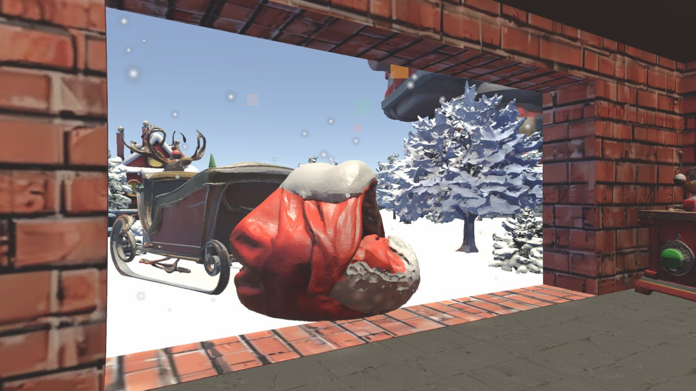
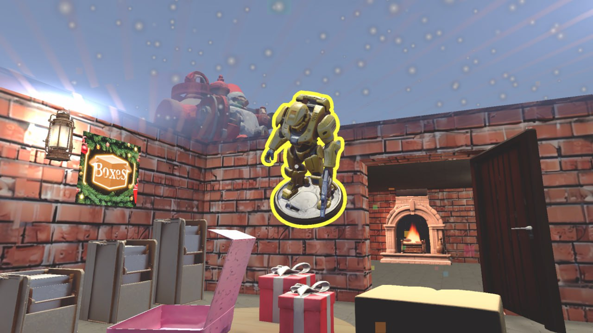

# GAGA: Game Asset Generative AI Pipeline

Official implementation of the paper
**“GAGA: Game Asset Generative AI Pipeline”**

[[Paper]](https://ieeexplore.ieee.org/abstract/document/11346631)



---

## Overview

GAGA is an open-source, containerized web application for generating game-ready 3D assets from text prompts or images.

Designed for educational and research use, it provides an end-to-end workflow that combines automated asset generation with interactive user control, enabling rapid creation of production-ready 3D content without requiring extensive modeling expertise.

The pipeline addresses a key accessibility challenge in game development education by lowering technical barriers to 3D asset creation while ensuring generated content is suitable for academic and commercial workflows.

---

## Key Features

- **Text-to-3D Generation:** Convert natural language descriptions into fully textured 3D models.
- **Interactive Point-Based Editing:** Fine-tune generated images before 3D reconstruction using intuitive drag-and-drop controls.
- **PBR Material Generation:** Automatically create physically-based rendering maps (ORM) for realistic lighting in game engines.
- **Engine Compatibility:** Export assets in FBX/OBJ formats compatible with Unity and Unreal Engine.
- **Modular Architecture:** Containerized microservices for flexible deployment and easy component updates.
- **Educational Focus:** Designed to lower technical barriers for students and educators in game development courses.

GAGA addresses a critical gap in game development education by enabling rapid asset creation without extensive 3D modeling expertise, while ensuring all generated content is copyright-safe for academic and commercial use.

---

## Setup

### Prerequisites

- [Docker](https://www.docker.com/get-started) and [Docker Compose](https://docs.docker.com/compose/install/)
- [NVIDIA GPU drivers](https://www.nvidia.com/Download/index.aspx) and [NVIDIA Container Toolkit](https://docs.nvidia.com/datacenter/cloud-native/container-toolkit/install-guide.html) for GPU support
- (Optional) [git](https://git-scm.com/) for cloning the repository

### Clone the Repository

```bash
git clone https://github.com/TZL0/gaga-pipeline.git
cd gaga-pipeline
```

### Environment Variables

Create a `.env` file in the root directory with the following content (replace with your actual values):

```env
HUGGINGFACE_HUB_TOKEN=hf_xxx   # Required for gated models
```

### Hugging Face Model Access

If you use gated models, request access on the Hugging Face model page and set your `HUGGINGFACE_HUB_TOKEN` in the `.env` file.

Note: The background removal service uses a gated model `briaai/RMBG-2.0`. If you require this feature, you will need to set your access token.

### Build and Start All Services

```bash
docker compose up --build
```

To start in detached mode:

```bash
docker compose up -d
```

### Service Endpoints

- **GenImageAPI:** http://localhost:8000
- **DragDiffusionAPI:** http://localhost:8010
- **RemoveBackgroundAPI:** http://localhost:8011
- **Gen3DAPI:** http://localhost:8001
- **PostProcessAPI:** http://localhost:8002
- **Client:** http://localhost:3000

### Notes

- Model files are cached in the `huggingface-cache` directory and mounted into each container.
- For GPU support, ensure your host system and Docker are properly configured for NVIDIA GPUs.
- If you encounter authentication errors with Hugging Face, verify your token and model access.

---

## Showcase

### Generated Assets



Figure 1: 3D models (middle and right) reconstructed from diffusion-generated images (left).




Figure 2: 3D model (middle and right) of a snowman reconstructed from a photo taken with an iPhone (left).

---

### Proof-of-Concept Game

We developed a complete Unity game using only AI-generated assets from GAGA to validate the pipeline's production readiness.

[Play the game here.](https://roultitude.itch.io/my-little-helper)





